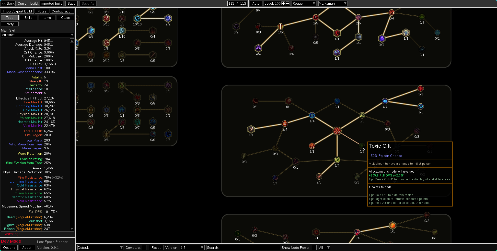
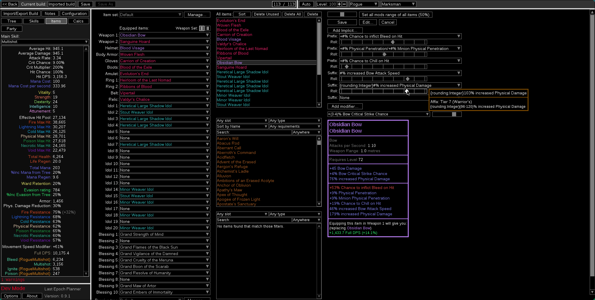

# Last Epoch Planner
## Welcome to Last Epoch Planner, an offline build planner for Last Epoch!

  
  

This is a fork of [Path of Building](https://github.com/PathOfBuildingCommunity/PathOfBuilding) adapted to work for the game **Last Epoch**.

Alternatively, the tool is available as a web-based version at https://lastepochplanner.com, which requires no installation.

> [!WARNING]
> This is a Third Party Program, any issues or bugs a player might experience in-game related to the use of this program
> are not the responsibility of Eleventh Hour Games (EHG), and EHG will not be able to assist.

## Features
The following features are supported (or partially):
* Passive tree
* Character import: for offline character and from LE tools build planner
* Items: Imported from character import and can be crafted / modified.
* Rare, Exalted, Unique, Legendary, Set and Idol items
* Blessings support
* Support for several stat calculations (including Health, Mana, Armor, Attributes, Ward, Resistances, ...)
* Skills: Select up to 5 skills, allowing you to spend points in the associated skill trees
* DPS calculation: support for several skills
* Support for chance to inflict ailments
* Support for debuff effects (resistance shred, chill, ...)

A lot of stats and mods/affixes are yet not working correctly.
* **Out of 15,506 mods, 5,465 (35%) mods are recognized by the parser**. Even if a mod is recognized, it's not guaranteed that it will work as expected.
* The total amount of mods is made of 
  * the implicits (one for each implicit of each item)
  * the prefixes and suffixes (one for each tier of each)
  * the unique modifiers (one for each mod of each unique)
  * the passive and skill trees (one for each mod of each node)

Note that **most content (docs or code) is outdated** since they only apply to the original project. Everything should be migrated as time goes by.

## Running
The current build can be launched by running `./runtime/Last Epoch Planner.exe`. 

## Linux support
For Linux, there may be native support in the future, but for now, it runs fine with Wine

## Features to be (possibly) automated from game files extracts
* Passive tree and skills sprites
* Any incorrect display names
* Item sprites
* Some stats formula data may be extracted
* Any missing stats on items or passives
* Skills info that would help in dps calculation

## Contribute
You can find instructions on how to contribute code and bug reports [here](CONTRIBUTING.md).

## Contributors
Special thanks for all the work made prior to this fork (and also to all future work that may be integrated in some ways) to the Path of Building Community contributors at https://github.com/PathOfBuildingCommunity/PathOfBuilding

## Changelog
You can find the full version history [here](CHANGELOG.md).

## License

[MIT](https://opensource.org/licenses/MIT)

For 3rd-party licenses, see [LICENSE](LICENSE.md).
The licencing information is considered to be part of the documentation.
